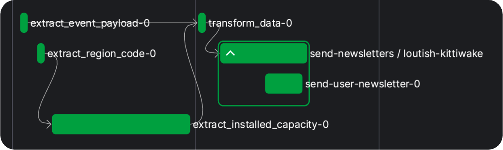
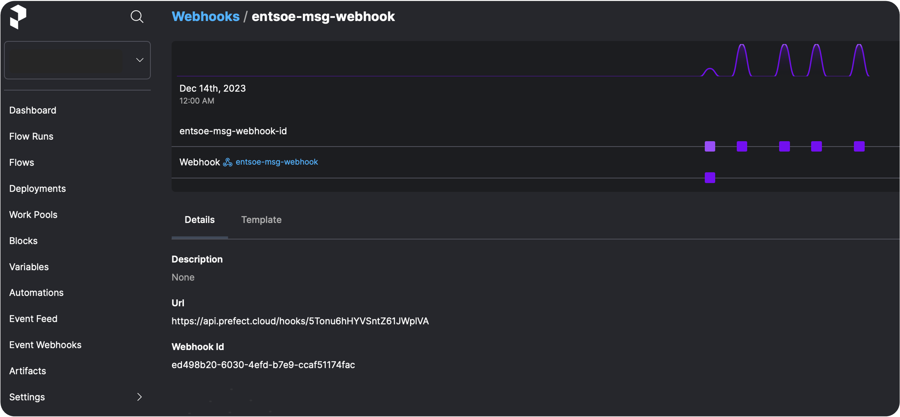

# Orchestrating Event-Driven Serverless Data Pipelines with Prefect + Pulumi + AWS
by Mira Theidel
## Content
This is an example project showcasing how to use the latest features of Prefect such as AWS ECS Push Work Pool, Webhooks & Automations.
The goal is to automatically detect and process incoming data from ENTSO-E Transparency Platform and orchestrate the dataflow serverlessly with Python. A combination of Prefect, Pulumi, GitHub Actions and AWS services is used.

<center>
 <figure>
 
 </figure>
</center>


>## Table of Contents
>- [Motivation](#motivation)
>- [Framework Choices](#framework-choices)
>   - [Why Prefect](#why-prefect)
>   - [Why Pulumi](#why-pulumi)
>   - [Why AWS ECS](#why-aws-ecs)
>- [Example Code](#get-ready-for-an-interesting-deep-dive-we-will-get-hands-on-now)
>- [Workflow](#workflow)
>- [Prerequisites](#prerequisites-to-run-and-deploy-the-workflow)
>- [Prefect Deployment](#prefect-deployment)
>- [Prefects new ECS Push Work Pool](#prefects-new-ecs-push-work-pool)
>- [Infrastructure Provisioning with Pulumi](#infrastructure-provisioning-with-pulumi)
>- [Prefect Event Webhooks and Deployment Triggers (Automations)](#prefect-event-webhooks-and-deployment-triggers-automations)
>- [Putting it All Together](#putting-it-all-together)
>- [GitHub Actions](#github-actions)
>- [Conclusion](#conclusion)


## Motivation
>Serverless, event-driven data pipelines are a natural fit for modern data engineering, as they provide a scalable, cost-effective, and flexible way to process large volumes of data on demand.

In general, data pipelines provide a systematic and automated approach to collecting, transforming, and structuring large amounts of data from multiple sources. The ultimate goal is to make them available downstream, in places such as data analysis, data visualization, or machine learning tasks.

To make this process serverless frees data engineers and scientists from the burden of infrastructure management and allows them to focus on building and implementing data workflows without worrying about provisioning and scaling servers. However, the downside is that users must pay for the services and computing resources.

In this context, event-driven processing not only enables responsiveness to real-time events in the data environment and dynamic execution of tasks. It also enables cost-efficient data processing, as computing resources scale automatically and are allocated dynamically and on demand. Users only pay for the computing resources that are actually used during data processing.

In this post, we will explore how to combine different frameworks such as Prefect, Pulumi and GitHub to build and deploy an event-driven, serverless data pipeline to AWS.

## Framework Choices
If you are a Python enthusiast like me:  
- this is exactly the right reading for you, as all the frameworks we will use offer the possibility to leverage Python.   

Else:  
- let me show you what is possible with Python beyond pure coding... :smile: 

### Why Prefect?
Prefect is a workflow orchestration platform and offers a very simple way of transforming any Python function into a unit of work that can be observed and orchestrated. With a few decorators, it adds functionalities like automatic retries, distributed execution and scheduling to your code and transforms it into resilient, dynamic workflows which are reactive and recover from unexpected changes. 

A big advantage is also that it allows for very easy scaling from simple local testing in Python to production use on (serverless) infrastructure of your choice, without changes.
You can build [scheduled] or [event-driven data pipelines], run them on your local machine or [serverless on GitHub] or more advanced on an AWS ECS Cluster, and stream even (near) [real-time], which makes it very versatile. 
With [Prefect Cloud] it also gives you a nice UI for visualizing your flow runs and configuring your Prefect components such as Work Pools, Blocks, Webhooks and Automations.

Compared to Apache Airflows DAGs'-based approach (Directed Acyclic Graphs, which enable explicit control over the sequence of task execution), Prefect is designed to make complex workflows simple and provides an intuitive framework for orchestrating them.
Prefect also supports event-driven workflows as a first-class concept, making it easy to trigger flows based on events. Furthermore, Prefect excels with its debugging capabilities and efficient scaling of infrastructure. 

### Why Pulumi?
[Pulumi] lets you define "Infrastructure as Code" (IaC), which is a concept of building and managing your custom cloud infrastructure by code.
This makes it easy to edit, distribute and version control your configurations. And moreover, you can automate the process of creating, but also updating and deleting the infrastructure with one command, which makes it very powerful in combination with CI/CD. 

In contrast to Terraform, Pulumi supports a wide range of programming languages for the infrastructure definition, allowing you to choose your favorite one. Guess, which we will use :wink:

### Why AWS ECS?
[AWS] Elastic Container Service (ECS) is a fully managed container orchestration service by Amazon and provides a powerful and scalable solution for deploying and managing containerized applications without having to manage the underlying infrastructure. 

The key component for the powerful interaction between Prefect and ECS is the AWS ECS API, which plays a crucial role in defining and configuring the tasks that run within ECS clusters. 
A task, in ECS terms, is the basic unit of work that represents a set of containerized applications or services running together. The ECS API enables users to specify various parameters for their tasks, such as the Docker image to use, CPU and memory requirements, networking configurations, and more. 

AWS ECS is one of the three common options, alternatively you could also use Google Cloud Run or Azure ACI.

## Get ready for an interesting deep dive, we will get hands on now!
Find the full code example in following [GitHub repo], the folder structure looks as shown below:
<style>
     pre {
       white-space: pre-wrap;
       overflow-x: scroll;
     }
</style> 
<pre>
<code style="white-space: pre; overflow-x: scroll;">
.
|- .github/workflows                            # github actions folder
|          |- gh_action_init_dataflows.yml
|          └- gh_action_delete_infra.yml
|- etl
|  |- __init__.py                               # initialize the etl package
|  |- dataflow.py                               # -> main workflow definition
|  |- utils.py
|  |- Dockerfile
|  └- requirements.txt                          # requirements for the dataflow
|
└- infrastructure
   |- __main__.py                               # pulumi main program
   |- Pulumi.dev.yaml
   |- Pulumi.yaml
   |- .env                                      # don't push to github
   └- requirements.txt                          # requirements for pulumi program
</code></pre>

## Workflow
As promised, the data_flow workflow is a decorated python function and quite easy to read:
```python
# dataflow.py

@flow
def data_flow(event_msg: str) -> None:
    event_payload = extract_event_payload(event_msg)
    region_code = extract_region_code(event_msg)
    region = lookup_area(region_code).meaning
    installed_capacity = extract_installed_capacity(region_code)
    data = transform_data(event_payload, installed_capacity)
    send_newsletters(data, region)
```

When you feed in an `event_msg`, the message payload and the region for which the data is provided will get extracted.
Then, some more data is gathered and transformed to finally be used for a newsletter, which will be sent to each registered user.   

You will notice that the functions used in this workflow are also decorated and are in fact prefect tasks and a sub-flow.  
This allows us to define retry functionality, for example for the case, that the API call or email send task does not work on the first attempt.

See the above flow with the related tasks and a second flow below:

```python
# dataflow.py

# some more imports here
from prefect import task, flow
from prefect.blocks.system import Secret
from prefect_email import EmailServerCredentials, email_send_message
from entsoe.parsers import parse_generation as entsoe_generation_parser
from entsoe.mappings import lookup_area
from entsoe import EntsoePandasClient
import pandas as pd
import re

from etl.utils import User, get_users
from etl.utils import mock_event_data


@flow
def data_flow(event_msg: str) -> None:
    event_payload = extract_event_payload(event_msg)
    region_code = extract_region_code(event_msg)
    region = lookup_area(region_code).meaning
    installed_capacity = extract_installed_capacity(region_code)
    data = transform_data(event_payload, installed_capacity)
    send_newsletters(data, region)


@task
def extract_event_payload(event_msg: str) -> str:
    return event_msg.split("<msg:Payload>")[1]


@task
def extract_region_code(payload_str: str) -> str:
    pattern = r">([^<]+)</inBiddingZone_Domain\.mRID>"
    match = re.search(pattern, payload_str)
    region_code = ""
    if match:
        region_code = match.group(1)
    return region_code


@task(retries=3, retry_delay_seconds=30, log_prints=True)
def extract_installed_capacity(region_code: str) -> pd.DataFrame:
    # use the prefet Secret Block here:
    entsoe_api_key = Secret.load("entsoe-api-key").get()
    now = pd.Timestamp.today(tz="Europe/Brussels")
    e_client = EntsoePandasClient(entsoe_api_key)

    try:
        return e_client.query_installed_generation_capacity(
            region_code,
            start=pd.Timestamp(year=now.year, month=1, day=1, tz="Europe/Brussels"),
            end=now,
        )
    except requests.exceptions.HTTPError as e:
        if e.response.status_code == 401:
            print("Authentication failed")
            return pd.DataFrame()
        else:
            raise


@task(retries=3, retry_delay_seconds=30)
def transform_data(
    xml_str: str,
    installed_capacity_df: pd.DataFrame
) -> Dict[str, Any]:

    generation_df = entsoe_generation_parser(xml_str)

    # ... some more steps for filtering 
    # ... and transforming the data ...
    # ... (find them in the repo) ...

    return {
        "chart": "<br>".join(chart_data), 
        "df": result_df, 
        "title": generation_type
    }


@flow(retries=3, retry_delay_seconds=30)
def send_newsletters(data: Dict[str, Any], region: str) -> None:
    """ example sub-flow in which the data will be sent to registered users;
    no load step in our etl here, in fact it's an ets ;)
    """
    # use the prefect Email Credentials Block here:
    email_server_credentials = EmailServerCredentials.load("my-email-credentials")
    users: List[User] = get_users()

    for user in users:
        msg = f"Hello {user.name}, <br> Please find our lastest update: <br><br>"
        # this is a pre-defined prefect task:
        email_send_message.with_options(name="send-user-newsletter").submit(
            email_server_credentials=email_server_credentials,
            subject=f"Newsletter: Generation {data['title']} - {region}",
            msg=msg
            + data["chart"]
            + "<br><br>"
            + data["df"].to_html(),
            email_to=user.email,
        )
```
It is possible to run this flow locally on your computer by feeding in some mocked data for the `event_msg`. You do not necessarily need the ENTSO-E API key for a first test run, but the newsletters data will be outdated and miss some information. All you have to prepare for this, is the "Prefect" step of the following [Prerequisites](#prerequisites-to-run-and-deploy-the-workflow), you may want to set the `entsoe_api_key=""`, if you don't have one so far, and the deployment mode to `LOCAL_TEST`.   
In fact, you could reduce the following code to one line: `if __name__ == "__main__": data_flow(mock_event_data())`, but I like to have the different options combined here. 
```python
# dataflow.py

if __name__ == "__main__":
    from enum import Enum
    DeployModes = Enum(
        "DeployModes",
        [
            "LOCAL_TEST",
            "LOCAL_DOCKER_TEST",
            "ECS_PUSH_WORK_POOL",
        ],
    )

    # Set your preferred flow run/ deployment mode here:
    deploy_mode = DeployModes.LOCAL_TEST

    if deploy_mode == DeployModes.LOCAL_TEST:
        # test flow with mocked event data 
        # and run it locally without deployment:
        data_flow(mock_event_data())
    else:
        ...
```
After running the command `python -m etl.dataflow` in your terminal, the flow is executed locally on your computer without being deployed to a work pool, so that you don't need to run an agent or worker to trigger the flow run. But you can still watch the flow run and metadata logs in [Prefect Cloud] and you will get a nice visualization of your flows:



Great, but at a certain point we want to close our laptop, and everything should work remotely and reactively (scheduled, event-driven). We have to deploy our flow and we have [two options](https://docs.prefect.io/latest/concepts/deployments/#two-approaches-to-deployments) for this: 
1) Serving flows on long-lived infrastructure: start a long-running process with the **.serve()** method in a location of choice  (often within a Docker container) that is responsible for managing all of the runs for the associated deployment(s). The process stays in communication with Prefect API and monitors and executes each flow run. It is simple, fast and the user has maximum control over infrastructure, but since it is a long running process, it is more costly since infrastructure must run the whole time.
2) Dynamically provisioning infrastructure with workers: **.deploy()** a flow to a work pool and then a worker will pick it up to execute the flow run on your infrastructure. With pull work pools you need to set up and maintain your own worker. But when using a push work pool, Prefect Cloud automatically handles the submission of scheduled jobs to our serverless infrastructure. The infrastructure is ephemeral and dynamically provisioned, which allows to essentially "scale to zero" when nothing is running. On the other hand, it is a more complex approach since a worker has more components and may be more difficult to set up and understand.

We will opt for the second approach and deploy() our flow to run serverless, which has recently become much easier with the Prefect push work pools, which do not need a seperate worker process running. However, since we are using multiple frameworks here, we must first complete the following prerequisites.

## Prerequisites to Run and Deploy the Workflow
> **_NOTE:_** unfortunately it takes some time until the ENTSO-E access is granted, but in the meantime you may want to get familiar with all the other frameworks and resources
### Prefect
- To run a Prefect flow, you have to [install](https://docs.prefect.io/latest/getting-started/installation/) Prefect locally - you may want to consider to pip install into a [virtual environment].
- Sign up for [Prefect Cloud]: if you want to run Prefect flows only locally or on a self-hosted version of the open source Prefect server you do not need to sign up. But as soon as you want to leverage workspaces, event-driven capabilities, webhooks, etc., you need a cloud workspace where you can additionally watch your flow runs in action.
- [Authenticate with Prefect Cloud]
- Create some Prefect Blocks in the Prefect Cloud UI as shown [here](https://medium.com/the-prefect-blog/supercharge-your-python-code-with-blocks-ca8a58128c55):
    - a String Block, where you deposit the email address of a test user (you can omit this step, if you are using a database where your "registered users" are persisted)
    - an Email Server Credentials Block, where you save the credentials of your email account, with which you want to send your newsletter (I used a googlemail account - you need to generate an app password)
    - a Seceret-Block with the ENTSO-E API key
- To run the flow serverless on AWS ECS Fargate:
    - an AWS Credentials Block
### ENTSO-E
- Sign up for the [ENTSO-E Transparency Platform] 
- Get [Restful API Access]
- Get Data Consumer [Subscription] rights (and subscribe to a data feed later on)
### AWS 
*to run our flow on AWS ECS Fargate, we will need the following configurations:*

#### a) Create an AWS IAM user with programmatic access and credentials file on your local machine to be generally able to deploy and update resources through Pulumi 
If you have previously installed and configured the AWS CLI, Pulumi will [respect and use your configuration settings.](https://www.pulumi.com/docs/clouds/aws/get-started/begin/)
- Sign up for AWS (you will be prompted for your Credit Card Number, but you get a free first year for trial usage which has some [AWS service restrictions])
- Create an `IAM User` in the AWS Management Console (Security Credentials/ Access Management on the left / Users => aws_access_key_id)
- after you have created an IAM user, click on the username and open the security credentials tab, create an `access key` for programmatical access (aws_secret_access_key)
- install `aws cli` (on mac: brew install awscli)
- run command `aws configure` in the terminal, you will be prompted for AWS Access Key ID and AWS Secret Access Key => a credentials file is created in user dir: ~/.aws/credentials (on a mac)
- Add the `IAMFullAccess` Policy to your newly created IAM user (Add permissions => Attach Policies Directly / Search for IAMFullAccess) to grant Pulumi the right to attach further policies to your IAM user, which are needed to make the Prefect ecs:push work pool work
#### b) Create an AWS IAM Role to manage the required project-specific policies; the role is assumed in the Pulumi program when the specific infrastructure is created (AWS_IAM_ROLE_TO_ASSUME):
- create an `IAM Role` in the AWS Management Console (Security Credentials/ Access Management on the left / Role => Create / Custom trust policy and put in the following custom trust policy - don't forget to add your own IAM User arn under Principal/ AWS:
```
    {
        "Version": "2012-10-17",
        "Statement": [
            {
                "Sid": "Statement1",
                "Effect": "Allow",
                "Principal": {
                    "AWS": "your_iam_user_arn_goes_here",
                    "Service": "rds.amazonaws.com"
                },
                "Action": "sts:AssumeRole"
            }
        ]
    }
```
  
 -  assign the necessary permissions to your IAM role:  
    - AmazonEC2ContainerRegistryFullAccess
    - AmazonEC2FullAccess
    - AmazonECS_FullAccess
    - AmazonElasticContainerRegistryPublicFullAccess
    - IAMFullAccess   
- you may want to further customize/ restrict the attached policies (assign the individual underlying policies instead of granting full access, but don't forget the necessary policies to destroy the resources afterwards!)

### GitHub
*necessary, as we will use GitHub Actions to deploy our AWS infrastructure with one click*
- Create a new GitHub repo
- Add the following secrets to your GitHub repo actions secrets: AWS_ACCESS_KEY, AWS_SECRET_ACCESS_KEY, PULUMI_ACCESS_TOKEN, PREFECT_API_KEY, PREFECT_WORKSPACE, AWS_IAM_USER_NAME, AWS_IAM_ROLE_TO_ASSUME (arn of the role). You can mainly follow the guide in this [article].

### Pulumi
- Make sure you have executed each step in the [AWS prerequisites](#aws)
- Create a [Pulumi account](https://www.pulumi.com)
- Install Pulumi cli (on macOS: brew install pulumi/tap/pulumi)
- Start in an empty infrastructure folder [like here](https://www.pulumi.com/docs/clouds/aws/get-started/create-project/) and run the command: 
```
$ pulumi new aws-python
```

## Prefect Deployment
If you have completed all the prerequisites, congratulations, you are now ready to deploy our flow and run it on an AWS ECS cluster. But wait, what exactly is a deployment and how can we do this?  
A deployment is an entry point to a Prefect flow. It contains all information about its configuration, more explicitly spoken: it defines when, how and where the flow run will be executed. You can write your deployment configuration into the [prefect.yaml] file, but it is also possible to submit the same information to the Prefect API with the flow method .deploy() in your python file.

```python
data_flow.deploy(
    "deployment_name",
    work_pool_name=work_pool_name,
    job_variables=job_variables,
    image=DeploymentImage(
        name=name,
        tag=image_tag,
        dockerfile=cfd / "Dockerfile",
    ),
    build=True,
    push=True,
    triggers=triggers,
)
```

This configuration of the .deploy() method will build a Docker image with your flow code baked into it and push the image to the (Docker Hub or other) registry specified in the image argument. We will specify our ECR url here. You may also use a custom Dockerfile in combination with a DeploymentImage object, as shown above. This gives you maximum flexibility to use specific flow run commands in a predefined flow execution environment.
>**_NOTE:_** You need to be authenticated to Prefect Cloud **and** your container registry when running the deployment by executing the python file -> in our case with the command `python -m etl.dataflow` while venv (the virtual environment) is activated

## Prefects new ECS Push Work Pool
In general, a flow is deployed to a work pool for scheduling. Traditionally, a worker (running in the execution environment) had to poll the work pool for new flow runs to execute (pull work pools), but now [push work pools] can submit flow runs to serverless infrastructure like Cloud Run, Azure Container Instances, and AWS ECS Fargate directly, without the need for an agent or worker to run. This makes the set-up a lot easier.  

The following high-level overview shows the conceptual elements involved in defining a `push` work pool based deployment. 


This overview is an adaption of the [official diagram] by Prefect, which shows the `pull` work-pool based deployment and involves a running worker process.  

When you create the ECS push work pool (you can do this directly in the Prefect Cloud UI, but we will create it with our GitHub Action by prefect cli), you don't have to set any of the job template parameters, as long as you submit them via the job_variables parameter of the flow deployment. The deployment-specific job variables always overwrite the work pool job template values. On the other hand, if you want to (and if they do not change), you can pre-populate the work pool job template with your infrastructure specific information, then you don't have to feed in the information with each deployment. But since we use Pulumi to set-up our infrastructure, we won't have this information in advance, we will submit them via the job variables in the deployment step of the GitHub Action (gh_action_init_dataflow.yml).

>**_ADVANCED:_** If you are already familiar with the [AWS Task Definition], you might have noticed, that not all parameters of the Task Definition Template are available in the base job template of the Prefect ECS (push) work pool. It is very easy to [adjust the job template], if you need to set a specific task definition parameter, the linked video shows how to do this in the Prefect Cloud UI. In short: put the desired parameter to the underlying work pool json definition (advanced tab of the work pool configuration), to ingest the needed parameters AND assign it also to the desired task definition parameter down at the bottom in the job configuration section (in jinja notation!).  
By the way: the following command will give you the base job template for the ecs:push work pool in the terminal: `prefect work-pool get-default-base-job-template --type ecs:push`

Recently, also a new optional ecs:push work pool parameter  [--provision-infra] was released:
```bash
prefect work-pool create --type ecs:push --provision-infra my_push_work-pool 
```
This option provides seamless automatic provisioning of the AWS infrastructure. Only the AWS credentials need to be provided, Prefect will then create the essential components such as ECR repository, ECS cluster, IAM user, IAM policy and VPC on your behalf. Hybrid solutions are also possible as existing resources will be detected with automatic infrastructure provisioning.

In this tutorial, however, we will create the infrastructure ourselves, which has the advantage that we have full control over the configurations and policies of the AWS components. In this context, the Pulumi framework proves to be very useful and a sophisticated solution.

## Infrastructure Provisioning with Pulumi
We will create the required AWS infrastructure ourselves? - No reason to panic.  
Everything is prepared in the `__main__.py` file of the infrastructure folder. If you are using Pulumi with Python, this is the main file to write the definitions of your AWS (or other cloud providers) infrastructure.  
We need to create the following components and later add them to the work pool job template, or as discussed above assign the information to the job_variables of the deployment:

- AWS ECR repository
- AWS ECS Cluster
- AWS VPC with following assigned to:
    - internet gateway
    - subnet
    - route table
- AWS IAM task role
- AWS IAM execution role

With the following command the infrastructure will be created (or updated, if Pulumi detects any changes in the `__main__.py` file): 
```bash
$ pulumi up
```
The Pulumi outputs are configured to give exactly the information, the work pool will need to submit the flow run (name, arn, url, etc.). We will feed this information into our work pool via the job variables of our deployment.
 
## Prefect Event Webhooks and Deployment Triggers (Automations)

OK, now we have defined our flow and the necessary AWS infrastructure, but how can we catch the message from the ENTSO-E web service with Prefect and how can we feed the message data into our flow? That's exactly where Prefect webhooks and automations come into play. They will make our flow run event-driven.  
A Prefect webhook exposes a public and unique URL endpoint to receive events from other systems (such as the ENTSO-E web service, but usually you would point [some other webhook] to it) and transforms them into Prefect events, which are logged and can be used in Prefect automations. They are defined by a template like the following in the terminal, but you can also create them in Prefect Cloud UI:
```bash
prefect cloud webhook create my_webhook \
--template '{ "event": "event_name", "resource": { "prefect.resource.id": "my-webhook-id" } }'
```
Cool, we just created a static webhook. Static, because we don't parse the event payload into a json. This is in this case not possible since we receive a xml message from ENTSO-E web service. But if the message payload is json parsable like in the GitHub webhook example, you can directly assign information to the emitted Prefect event by assigning them in the template.

So, what can we actually do with our newly created webhook?  
We can use the emitted Prefect event, which is fired when a message reaches the webhooks url endpoint, to trigger an automation and pass the messages information to our flow run at runtime.

Automations in Prefect Cloud enable you to configure actions that Prefect executes automatically based on trigger conditions related to your flows and work pools.
You can set up an automation in the Cloud UI, but it is also possible to create a new automation directly with your deployment when executing the python deploy method:
```python
data_flow.deploy(
    ...
    triggers = [
        DeploymentTrigger(
            match={"prefect.resource.id": "my-webhook-id"},
            parameters={"event_msg": "{{ event.payload.body }}"},
        )
    ]
)
```
The automation has two parts. The match part looks for every Prefect event and matches on the specified resource id, in this case the id of the newly created static webhook from above. The parameters' part sets the parameters to be fed into the deployed flow. Since our flow [data_flow] has an `event_msg` parameter, this has to be assigned in the parameters part of the automation, in this case we assign the whole payload body of the event to it.

## Putting it all together

Now that we've discussed each piece of our event-driven, serverless workflow puzzle, we'll put it all together. The following visualization shows the big picture of the ecs:push work pool on the Prefect side, and the AWS ECR and ECS services on the other side. The ECS API and the ECS Task Definition act as an interface. The following image was mainly composed by combining the following resources: [AWS ECS Fargate architecture] and [Prefect Push Work Pool Setup].


The visualization covers all steps of the flow run submission process.  
We initially deploy the flow from our local computer to Prefect Cloud (or via GitHub Action which is not shown here). The Prefect API will then submit the deployment to the specified work pool and pushes the Docker container image of the flow to AWS ECR. In the same time a Prefect Automation will be created, since we assigned a DeploymentTrigger to the trigger parameter of our deployment. 
The automation will wait for any Prefect event emitted by the webhook (or any other Prefect event with the same resource id, which we will finally see as last step of the initializing GitHub Action). So, when the ENTSO-E message with a data update hits our webhook, a flow run is triggered immediately by the automation (with the ENTSO-E data passed in) and the work pool will submit the flow run to the serverless AWS infrastructure, which we specified in the job_variables. Therefore, Prefect provides the AWS ECS API with metadata which include the full task definition parameter set, which is used in turn to generate an ECS task. The task is provided with the flow Docker image url and is specified to run our flow from the image.  

## GitHub Actions
Finally, we will now use GitHub Actions to automatically set-up the whole AWS infrastructure, create a Prefect work pool and a webhook, and deploy the flow to it with a Deployment trigger assigned. As last step, the GitHub Action will fire a test event to the automation, so that we can see everything in action. You will need to pass in your preferred AWS region and the aws_credential_block_id. You can get the id by executing `prefect blocks ls` in your terminal after you created the AWS Credentials Block in the Prefect Cloud UI.

So in fact, once everything is configured (prerequisites!), you can set up the deployment of the whole infrastructure and the flow all at once, with only one click on GitHub (gh_action_init_dataflows.yml): 


As you might have recognized, the GitHub Action has 2 jobs, first it creates the AWS infrastructure and then it deploys the flow to Prefect API, utilizing the received infrastructure identifying names from the previous step. If you are interested, you can inspect every step and output on GitHub.


The webhook and automation are now alive and are waiting for incoming data/ events. You may want to look into the automations' events to prove this, since our last GitHub step emitted a simulated event, the Prefect automation was already triggered with some mocked data and we should have received our first newsletter (with mocked data).
The next (and final) step is to find the webhooks url in Prefect Cloud UI. You need to copy the url and create a [Subscription] Channel on ENTSO-E platform. Now subscribe for a specific ENTSO-E web service (for example for "Generation Forecasts for Wind and Solar" or "Actual Generation per Production Type", the latter arrives every hour while the forecast will be sent only once a day; you may want to select your country and the generation types of interest) by clicking the button directly above the desired diagram on ENTSO-E transparency platform:   


The data will arrive at the webhooks endpoint as soon as ENTSO-E sends an update message. You may want to observe this in the Events Feed:
  

  
After catching the data message, the webhook triggers the automation and finally, the registered user(s) will get their automated, on demand newsletter, as soon as new data from ENTSO-E arrives :rocket: :


       
>Now, that we have reached the end of this tutorial, you may want to delete the AWS infrastructure we just created. All you have to do is to run the next GitHub Action (gh_action_delete_infra.yml) and provide again (the same!) AWS region and ECR repo name. You will find the ECR repo name in the AWS management console or you can just refer to the initializing GitHub Action output.

## Conclusion
We have explored how to effectively combine the frameworks Prefect and Pulumi (among some others) to successfully build an event-driven serverless data pipeline that automatically receives the updates from the ENTSO-E web service, transforms the data and then sends a newsletter to registered users. 
We have accomplished to deploy the AWS infrastructure and the Prefect flow all in one step seamlessly and automated without giving away control over AWS policies and cluster settings. In addition, by using a Prefect ECS push work pool, we have found a cost-efficient solution in which a task is only executed on the ECS cluster when data actually needs to be processed.

If you have any questions regarding this setup or anything is unclear, please do not hesitate to contact me.

---
In close cooperation with the [pybites](https://pybit.es) team.


[Prefect Cloud]:                        https://www.prefect.io
[Prefect Docs]:                         https://docs.prefect.io/latest/ 
[Authenticate with Prefect Cloud]:      https://www.youtube.com/watch?v=AjYHBwH2Mtc
[Pulumi]:                               https://www.pulumi.com
[ENTSO-E Transparency Platform]:        https://transparency.entsoe.eu/
[Restful API Access]:                   https://transparency.entsoe.eu/content/static_content/Static%20content/web%20api/Guide.html#:~:text=To%20request%20access%20to%20the,registration%20in%20the%20email%20body.
[Subscription]:    https://transparency.entsoe.eu/content/static_content/Static%20content/knowledge%20base/SubscriptionGuide.html
[AWS]:                                  https://aws.amazon.com/de/free/?trk=10e7ff14-4e14-49d5-9724-e9c8df2821ae&sc_channel=ps&ef_id=CjwKCAiAg9urBhB_EiwAgw88mcWBW6hImZSWUyh0-t_zQNfiTZfOi2SGJdRIStcNeCdGJjCOy7kI-hoCFI0QAvD_BwE:G:s&s_kwcid=AL!4422!3!645186168181!p!!g!!aws!19571721561!148952143087&gclid=CjwKCAiAg9urBhB_EiwAgw88mcWBW6hImZSWUyh0-t_zQNfiTZfOi2SGJdRIStcNeCdGJjCOy7kI-hoCFI0QAvD_BwE&all-free-tier.sort-by=item.additionalFields.SortRank&all-free-tier.sort-order=asc&awsf.Free%20Tier%20Types=*all&awsf.Free%20Tier%20Categories=*all
[AWS service restrictions]:             https://aws.amazon.com/de/free/?trk=9ab5159b-247d-4917-a0ec-ec01d1af6bf9&sc_channel=ps&ef_id=CjwKCAiAg9urBhB_EiwAgw88mR4zIZm3AgYc3nAc8kv0RRY4Xuw8AkUcQPEHsTah8OpQvjUdPo1AzxoC_YQQAvD_BwE:G:s&s_kwcid=AL!4422!3!645133561113!e!!g!!aws%20free%20trial!19579657595!152087369904&gclid=CjwKCAiAg9urBhB_EiwAgw88mR4zIZm3AgYc3nAc8kv0RRY4Xuw8AkUcQPEHsTah8OpQvjUdPo1AzxoC_YQQAvD_BwE&all-free-tier.sort-by=item.additionalFields.SortRank&all-free-tier.sort-order=asc&awsf.Free%20Tier%20Types=tier%2312monthsfree&awsf.Free%20Tier%20Categories=*all

[push work pools]:                      https://github.com/PrefectHQ/prefect/blob/3a73fc6b0976332972fd62d037c30a31c04448e9/docs/guides/deployment/push-work-pools.md
[event-driven data pipelines]:          https://www.youtube.com/watch?v=khVS5M3QY54
[scheduled]:                            https://www.youtube.com/watch?v=hKD-Tw_pnYc 
[real-time]:                            https://annageller.medium.com/serverless-real-time-data-pipelines-on-aws-with-prefect-ecs-and-github-actions-1737c80da3f5#655e

[article]:                              https://annageller.medium.com/serverless-real-time-data-pipelines-on-aws-with-prefect-ecs-and-github-actions-1737c80da3f5#655e#:~:text=Configure%20repository%20secrets

[serverless on GitHub]:                 https://github.com/hashboard-hq/examples/tree/main/snow_leaderboard
[GitHub repo]:                          https://github.com/mt7180/prefect-pulumi-data-orchestration
[virtual environment]:                  https://www.youtube.com/watch?v=UqkT2Ml9beg
[prefect.yaml]:                         https://docs.prefect.io/latest/guides/prefect-deploy/#:~:text=prefect.yaml
[AWS ECS architecture]:                 https://docs.aws.amazon.com/AmazonECS/latest/developerguide/launch_types.html
[AWS Task Definition]:                  https://docs.aws.amazon.com/AmazonECS/latest/developerguide/task-definition-template.html
[adjust the job template]:              https://www.youtube.com/live/1tv6w22o7mI?si=mDngWuC6zJRkXRKG&t=2031
[Prefect Push Work Pool Setup]:         https://www.youtube.com/live/1tv6w22o7mI?si=soe8OFqf9KHI_Tg_&t=1600
[AWS ECS Fargate architecture]:         https://docs.aws.amazon.com/AmazonECS/latest/developerguide/launch_types.html
[--provision-infra]:                    https://docs.prefect.io/latest/guides/deployment/push-work-pools/
[some other webhook]:                   https://www.youtube.com/watch?v=khVS5M3QY54
[event driven example]:                 https://medium.com/the-prefect-blog/beyond-scheduling-event-driven-flows-with-prefect-b072edd06833

[data_flow]:                            https://github.com/mt7180/prefect-pulumi-data-orchestration/blob/2840c265b5303d64c7ebd545404219a3c7021342/etl/dataflow.py#L101
[official diagram]: https://docs.prefect.io/latest/guides/prefect-deploy/#:~:text=high-level%20overview