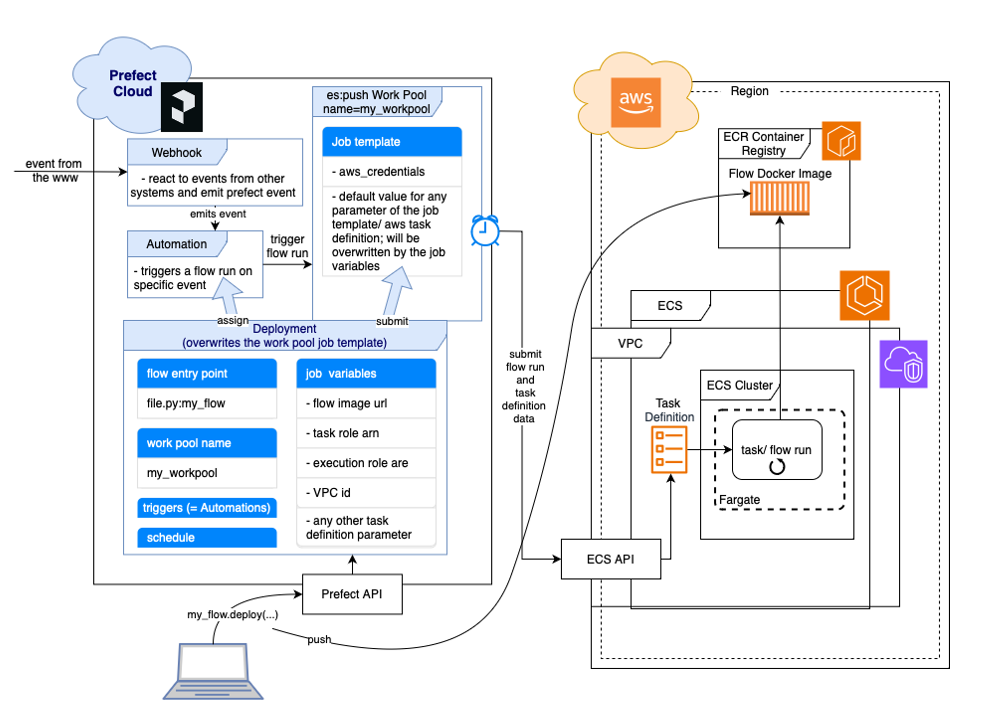

## Orchestrating Event-Driven Serverless Data Pipelines and Architecture with Prefect + Pulumi + AWS: 
### An example project showcasing how to use the new Prefect features such as AWS ECS:push Work Pool, Webhook & Automation to detect and process incoming data from entso-e Transparency Platform automatically and orchestrate the dataflow serverless with Python. The project is built using Prefect, Pulumi, GitHub Actions and AWS services.

 <figure style="text-align: center;">
 
 </figure>


>### Table of Contents:
>- [Motivation](#motivation)
>- [Frameworks](#frameworks)
>   - [Why Prefect](#why-prefect)
>   - [Why Pulumi](#why-pulumi)
>   - [Why AWS ECS](#why-aws-ecs)
>- [The Example Code](#get-ready-for-an-exciting-deep-dive-we-will-get-hands-on-now)
>- [The Workflow](#the-workflow)
>- [Prerequisites](#prerequisites-to-run-the-workflow)
>- [The Prefect Deployment](#deployment)
>- [Prefects new ECS Push Work Pool](#prefects-new-ecs-push-work-pool)
>- [Prefect Event Webhooks and Deployment Triggers (Automations)](#prefect-event-webhooks-and-deployment-triggers-automations)
>- [Putting it All Together](#putting-it-all-together)
>- [The GitHub Actions](#the-github-actions)


### Motivation
todo: ...small motivation text on workflow orchestration and event driven data pipelines...

### Frameworks
A small side note: If you are a Python enthusiast like me, this is exactly the right reading for you, as all the frameworks we will use offer the possibility to leverage Python. If not: let me show you what is possible with Python beyond pure coding... :smile: 

#### Why Prefect?
Prefect is a workflow orchestration platform and offers a very simple way of transforming any Python function into a unit of work that can be observed and orchestrated. 
With a few decorators, it adds functionalities like automatic retries, distributed execution and scheduling to your code and transformes it into resilient, dynamic workflows which are reactive and recover from unexpected changes. 
A big advantage is also, that it allows for very easy scaling from simple local testing in Python to productional use on (serverless) infrastructure of your choice, without changes.
You can build [scheduled] or [event-driven data pipelines], run them on on your local machine or [serverless on GitHub] or more advanced on an AWS ECS Cluster, and stream even (near) [real-time], which makes it is very versatile. With [Prefect Cloud] it also gives you a nice UI for visualizing your flow runs and configuring your Prefect components such as work pools, Blocks, Webhooks and Automations.

Compared to Apache Airflows DAGs-based approach (Directed Acyclic Graphs, which enable explicit control over the sequence of task execution), Prefect is designed to make complex workflows simple and provides an intuitive framework for orchestrating them. Prefect also supports event-driven workflows as a first class concept, making it easy to trigger flows based on events. Furthermore, Prefect excels with its debugging capabilities and efficient scaling of infrastructure. 

#### Why Pulumi?
[Pulumi] lets you define "Infrastructure as Code" (IaC), which is a concept of building and managing your custom cloud infrastructure by code and makes it easy to edit, distribute and version control your configurations. And moreover, you can automate the process of creating, but also updating and deleting the infrastructure with one command, which makes it very powerful in combination with CI/CD. Pulumi supports a wide range of programming languages for the infrastructure definition, allowing you to choose your favorite one. Guess, which we will use :wink:

#### Why AWS ECS?
[AWS] Elastic Container Service (ECS) is a fully managed container orchestration service by Amazon and provides a powerful and scalable solution for deploying and managing containerized applications without having to manage the underlying infrastructure. The key component for the powerful interaction between Prefect and ECS is the AWS ECS API, which plays a crucial role in defining and configuring the tasks that run within ECS clusters. A task, in ECS terms, is the basic unit of work that represents a set of containerized applications or services running together. The ECS API enables users to specify various parameters for their tasks, such as the Docker image to use, CPU and memory requirements, networking configurations, and more. 
AWS ECS is one of the three common options, you could also use Google Cloud Run or Azure ACI.
 
---   
## Get ready for an exciting deep-dive, we will get hands on now!
Find the full code example in following [GitHub repo], the folder structure looks as shown below:
<style>
     pre {
       white-space: pre-wrap;
       overflow-x: scroll;
     }
</style> 
<pre>
<code style="white-space: pre; overflow-x: scroll;">
.
|- .github/workflows                            # github actions folder
|          |- gh_action_init_dataflows.yml
|          └- gh_action_delete_infra.yml
|- etl
|  |- __init__.py                               # initialize the etl package
|  |- dataflow.py                               # -> main workflow definition
|  |- utils.py
|  |- Dockerfile
|  └- requirements.txt                          # requirements for the dataflow
|
└- infrastructure
   |- __main__.py                               # pulumi main program
   |- Pulumi.dev.yaml
   |- Pulumi.yaml
   └- requirements.txt                          # requirements for pulumi program
</code></pre>

### The Workflow
As promised, the data_flow workflow is a decorated python function and quite easy to read:
```python
# dataflow.py

@flow
def data_flow(event_msg: str) -> None:
    event_payload = extract_event_payload(event_msg)
    installed_capacity = extract_installed_capacity()
    data = transform_data(event_payload, installed_capacity)
    send_newsletters(data)
```
When you feed in an event message string, the message payload will get extracted, some more data is gathered and transformed to finally be used for a newsletter, which will be sent to each registered user.   

The functions used in this workflow are also decorated and are in fact prefect tasks and a subflow, which benefit from the defined retry functionality, if, for example, the API call or email send task does not work on the first attempt:  
```python
# dataflow.py

# some more imports here
from prefect import task, flow
from prefect.blocks.system import Secret
from prefect_email import EmailServerCredentials, email_send_message
from entsoe.parsers import parse_generation as entsoe_generation_parser
from entsoe import EntsoePandasClient

from etl.utils import User, get_users
from etl.utils import mock_event_data


@task
def extract_event_payload(event_msg: str) -> str:
    return event_msg.split("<msg:Payload>")[1]


@task(retries=3, retry_delay_seconds=30)
def extract_installed_capacity() -> pd.DataFrame:
    # use the prefet Secret Block here:
    entsoe_api_key = Secret.load("entsoe-api-key").get()
    now = pd.Timestamp.today(tz="Europe/Brussels")
    e_client = EntsoePandasClient(entsoe_api_key)
    return e_client.query_installed_generation_capacity(
        "DE",
        start=pd.Timestamp(year=now.year, month=1, day=1, tz="Europe/Brussels"),
        end=now,
    )


@task(retries=3, retry_delay_seconds=30)
def transform_data(
    xml_str: str,
    installed_capacity_df: pd.DataFrame
) -> Dict[str, Any]:

    generation_forecast_df = entsoe_generation_parser(xml_str)

    # ...some more steps for filtering 
    # ... and transforming the data ...

    return {
        "chart": "<br>".join(chart_data), 
        "df": result_df, 
        "title": generation_type
    }


@flow(retries=3, retry_delay_seconds=30)
def send_newsletters(data: Dict[str, Any]) -> None:
    """ example sub-flow in which the data will be sent to registered users;
    no load step in our etl here, in fact it's an et ;)
    """
    # use the prefect Email Credentials Block here:
    email_server_credentials = EmailServerCredentials.load(
        "my-email-credentials"
    )
    users: List[User] = get_users()

    for user in users:
        msg = "some text here"
        # this is a pre-defined prefect task:
        email_send_message.with_options(name="send-user-newsletter").submit(
            email_server_credentials=email_server_credentials,
            subject=f"Newsletter: Intraday Generation: {data['title']}",
            msg=msg
            + data["chart"]
            + "<br><br>"
            + data["df"].to_html(),
            email_to=user.email,
        )

```
It is possible to run this flow locally on your computer by feeding in some mocked data for the event_msg. You don't necessarily need the entso-e api key for a first test run, but the newsletters data will be outdated and miss some information. All you have to prepare for this, is the "Prefect" step of the following [Prerequisits](#prerequisites-to-run-the-dataflow), you may want to set the entsoe_api_key="", if you don't have one so far, and the deployment mode to "LOCAL_TEST". In fact, you could reduce the following code to one line: `if __name__ == "__main__": data_flow(mock_event_data())`, but I like to have the different optiones combined here. 
```python
# dataflow.py

if __name__ == "__main__":
    from enum import Enum
    DeployModes = Enum(
        "DeployModes",
        [
            "LOCAL_TEST",
            "LOCAL_DOCKER_TEST",
            "ECS_PUSH_WORK_POOL",
        ],
    )

    # Set your preferred flow run/ deployment mode here:
    deploy_mode = DeployModes.LOCAL_TEST

    if deploy_mode == DeployModes.LOCAL_TEST:
        # test flow with mocked event data 
        # and run it locally without deployment:
        data_flow(mock_event_data())
    else:
        ...
```
After running the command `python -m etl.dataflow` in your terminal, the flow is executed locally on your computer without being deployed to a work pool, so that you don't need to run an agent or worker to trigger the flow run. But you can still watch the flow run and metadata logs in [Prefect Cloud] and you will get a nice visualization of your flows:


Great, but at a certain point we want to close our laptop and everything should work remotely and reactive (scheduled, event-driven). We have to deploy our flow and we have [two options](https://docs.prefect.io/latest/concepts/deployments/#two-approaches-to-deployments) for this: 
1) Serving flows on long-lived infrastructure: start a long-running process with the **.serve()** method in a location of choice  (often within a Docker container) that is responsible for managing all of the runs for the associated deployment(s). The process stays in communication with Prefect API and monitors and executes each flow run. It is simple, fast and the user has maximum control over infrastructure, but since it is a long running process, it is more costly since infrastructure has to run the whole time.
2) Dynamically provisioning infrastructure with workers: **.deploy()** a flow to a work pool and then a worker will pick it up to execute the flow run on your infrastructure. In pull work pools you need to set up and maintain your own worker (but we will use the new push work pool feature). The infrastructure is ephemeral and dynamically provisioned, which allows to essentially "scale to zero" when nothing is running, as the worker process is much more lightweight than the workflows themselves, which is a big advantage. On the other hand it is a more complex approach, since a worker has more components and may be more difficult to set up and understand.

We will opt for the second approach and deploy() or flow, which has recently become much easier with the push work pools. However, since we are using multiple frameworks here, we must first complete the following prerequisits.

> **_NOTE:_** unfortunately it takes some time until the entso-e access is granted, but in the meantime you may want to get familiar with all the other frameworks and resources

### Prerequisites to Run and Deploy the Workflow
#### Prefect
- To run a prefect flow, you have to [install](https://docs.prefect.io/latest/getting-started/installation/) it locally, you may want to consider to pip install into a [virtual environment].
- Sign up for [Prefect Cloud]: if you want to run prefect flows only locally, you do not need to sign up. But as soon as you want to leverage deployments, scheduling, prefect blocks, etc, you need a cloud workspace where you can additionally watch your flow runs in action.
- [Authenticate with Prefect Cloud]
- Create some Prefect Blocks in the Prefect Cloud UI as shown [here](https://medium.com/the-prefect-blog/supercharge-your-python-code-with-blocks-ca8a58128c55):
    - a String Block, where you deposite the email address of a test user (you can ommit this step if you are using a database where your "registered users" are persisted)
    - an Email Server Credentials Block, where you save the credentials of your email account, with which you want to send your newsletter (I used a googlemail account, you need to generate an app password)
    - a Seceret-Block with the entsoe-api-key
- To run the flow serverless on AWS ECS Fargate:
    - an AWS Credentials Block
#### Entso-e
- Sign up for the [entso-e Transparency Platform]
- Get [Restful API Access]
- Get [Data Consumer Subscription rights] and subscribe to a data feed 
#### AWS 
*to run our flow on AWS ECS Fargate, we will need the following configurations:*
- Sign up for AWS (you will be prompted for your Credit Card Number, but you get a free first year for trial usage which hase some [AWS service restrictions])
- Create an IAM user in the AWS Management Console (in access management / Users => aws_access_key_id) and assign the necessary permissions to your IAM user (ECR, ECS ... todo: give list of policies for ECR, ECS ...) 
- when you have created an IAM user, click on the user name and open the security credentials tab, create an access key for programmatical access (aws_secret_access_key)
- install aws cli (on mac: brew install awscli)
- run command "aws configure" in the terminal, you will be prompted for AWS Access Key ID and AWS Secret Access Key => a credentials file is created in user dir: ~/.aws/credentials
#### GitHub
*necessary, as we will use GitHub Actions to deploy our AWS infrastructure with one click*
- Create a new GitHub repo
- Add the following secrets to your GitHub repo actions secrets: AWS_ACCESS_KEY, AWS_SECRET_ACCESS_KEY, PULUMI_ACCESS_TOKEN, PREFECT_API_KEY, PREFECT_WORKSPACE, you can mainly follow the guide in this [article].
#### Pulumi
- Make sure you have executed each step in the [AWS prerequisites](#aws)
- Create a [Pulumi account](https://www.pulumi.com)
- Install pulumi cli (on macOS: brew install pulumi/tap/pulumi)
- Start in an empty infrastructure folder [like here](https://www.pulumi.com/docs/clouds/aws/get-started/create-project/) and run the command: 
```
$ pulumi new aws-python
```

### The Prefect Deployment
If you have now completed all the prerequisits, congratulations, you are now ready to deploy our flow and run it on an AWS ECS Cluster. But wait, what exactly is a deployment and how do we do this?  
A deployment is an entrypoint to a Prefect flow. It contains all information about its configuration, more explicitely spoken: it defines when, how and where the flow run will be executed. You can write your deployment configuration into the [prefect.yaml] file, but it is also possible to submit the same information to the Prefect API with the flow method .deploy() in your python file.

```python
data_flow.deploy(
    "deployment_name",
    work_pool_name=work_pool_name,
    job_variables=job_variables,
    image=DeploymentImage(
        name=name,
        tag=image_tag,
        dockerfile=cfd / "Dockerfile",
    ),
    build=True,
    push=True,
    triggers=triggers,
)
```

The .deploy method will build a Docker image with your flow code baked into it and push the image to the (Docker Hub or other) registry specified in the image argument. You may also use a custom Dockerfile in combination with an  DeploymentImage object, as shown above. This gives you maximum flexibility to run specific flow run commands in a predefined flow execution environment.
>Note: You need to be authenticated to Prefect Cloud and your container registry when running the deployment by executing the python file (in our case with the command `python -m etl.dataflow`` while venv is activated)

### Prefects new ECS Push Work Pool
In general, a flow is deployed to a work pool for scheduling. Traditionally, a worker (running in the execution environment) had to poll the work pool for new flow runs to execute (pull work pools), but now [push work pools] can submit flow runs to serverless infrastructure like Cloud Run, Azure Container Instances, and AWS ECS Fargate directly, without the need for an agent or worker to run. This makes the set-up a lot easier.  
When you create the ECS push work pool (you can do this directly in the Prefect Cloud UI, but  we will create it with our GitHub action by prefect cli), you don't have to set any of the job template parameters, as long as you submit them via the job_variables parameter of the flow deployment. The deployment-specific job variables always overwrite the work pool job template values. On the other hand you can pre-populate the work pool job template with your infrastructure specific information, if you want to (and they don't change). But since we use pulumi to set-up our infrastructure, we won't have this information in advance, we will submit them via the job variables in the deployment step of the GitHub Action (gh_action_init_dataflow.yml).
>Advanced: If you are already familiar with the [AWS Task Definition], you might have noticed, that not all parameters of the Task Definition Template are available in the base job template of the Prefect ECS (push) work pool. It is very easy to [adjust the job template], if you need to set a specific task definition parameter, the linked video shows how to do this in the Prefect Cloud UI. In short: put the desired parameter to the underlaying work pool json definition (advanced tab of the work pool configuration), to ingest the needed parameters AND assign it also to the desired task definition parameter down at the bottom in the job configuration section (in jinja notation!).  
By the way: the following command will give you the base job template for the ecs:push work pool in the terminal: `prefect work-pool get-default-base-job-template --type ecs:push`

 
Recently, also a new optional ecs push work pool parameter  [--provision-infra] was released:
```bash
prefect work-pool create --type ecs:push my_push_work-pool --provision-infra
```
This option provides seamless automatic provisioning of the AWS infrastructure. Only the AWS credentials need to be provided, Prefect will then create the essential components such as ECS cluster, IAM role and VPC on your behalf. Unfortunately, this option did not work for our particular configuration. Moreover, if you want to have full control over all configurations for the AWS components and policies, you need to create the infrastructure by yourself. In this context, the Pulumi framework proves to be very useful and a sophisticated solution.
 
### Prefect Event Webhooks and Deployment Triggers (Automations)
OK, now we have defined our flow and the necessary AWS infrastructure, but how can we catch the message from the entso-e web service with Prefect and how can we feed the message data into our flow? Thats exactly the point where Prefect webhooks and automations come into play. They will make our flow run event-driven.  
A Prefect webhook exposes a public and unique URL endpoint to receive events from other systems (such as the entso-e web service, but usually you would point [some other webhook] to it) and transforms them into Prefect events, which are logged and can be used in Prefect automations. They are defined by a template like the following in the terminal, but you can also create them in Prefect Cloud UI:
```bash
prefect cloud webhook create my_webhook \
--template '{ "event": "event_name", "resource": { "prefect.resource.id": "my-webhook-id" } }'
```
Cool, we just created a static webhook. Static, because we don't parse the event payload into a json. This is in this case not passible, since we receive a xml message from entso-e web service. But if the message payload is json parsable like in the GitHub webhook example, you can directly assign information to the emitted Pefect event.

So what can we actually do with our newly created webhook?  
We can use the emitted Prefect event, which is fired when a message reaches the webhooks url endpoint, to trigger an automation and pass the messages information to our flow run at runtime.

Automations in Prefect Cloud enable you to configure actions that Prefect executes automatically based on trigger conditions related to your flows and work pools.
You can set up an automation in the Cloud UI, but it is also possible to create a new automation directly with your deployment when executing the python deploy method:
```python
data_flow.deploy(
    ...
    triggers = [
        DeploymentTrigger(
            match={"prefect.resource.id": "my-webhook-id"},
            parameters={"event_msg": "{{ event.payload.body }}"},
        )
    ]
)
```
The automation has two parts. The match part looks for every Prefect event and matches on the specified resource id, in this case the id of the newly created static webhook from above. The parameters part sets the parameters to be fed into the deployed flow. Since our flow has an event_msg parameter, this has to be assigned in the parameters part of the Automation, in this case we assign the whole payload body of the event to it.

### Putting it all together

Now that we've discussed each piece of our event-driven, serverless workflow puzzle, we'll put it all together. The following visualization shows the big picture of the ecs:push work pool with the Prefect side, the AWS side, and the interface in-between, the ECS Task Definition. The picture is mainly based on the following resources: [AWS ECS Fargate architecture] and [Prefect Push Work Pool Setup]



The visualization covers all steps of the flow run submition process. When we deploy the flow from our local computer to Prefect Cloud (or via Github action which is not shown here), the Prefect API will submit the deployment to the specified work pool and pushes the Docker container image of the flow to AWS ECR. In the same time an Automation will be created, because we set the trigger parameter to a DeploymentTrigger. The automation waits for a Prefect event emitted by the webhook (or any other Prefect event with the same resource id which you will see when we test our automated datapipeline in the init github action with the emit_event function). So when the entso-e message with a data update hits our webhook, a flow run is triggered immediately by the automation (with the entso-e data passed in) and the work pool will submit the flow run to the serverless AWS infrastructure, which we specified in the job_variables. Therefore, Prefect provides the AWS ECS API with metadata which include the full task definition parameter set, which is used in turn to generate an ECS task. The task is provided with the flow Docker image url and is specified to run our flow from the image.  
As mentined before, for this ecs:push work pool setup, we have to provide the work pool with some information about the infrastructure we want to use for our flow run. Therefore, we have to manually create and assign them to the job variables of a deployment, which will overwrite the work pool job template.

### The GitHub Actions
>Note: Find the mainn Pulumi program in the `__main__.py` file of the infrastructure folder to get more information about the AWS infrastructure definitions.

We are using Github actions for our example project to automatically set-up the AWS infrastructure, create a Prefect work pool and a webhook, and deploy the flow to it with a Deployment trigger assigned. You will need to pass in your preferred aws region and the aws_credential_block_id. You can get the id by executing `prefect blocks ls` in your terminal.

So in fact, once everything is configured (Prerequisits!), everything is set-up with one click in GitHub.   


->  


After subscribing for the entso-e web service (for example for the Generation Forecasts for Wind and Solar) the data arrives regularly which can be observed in the Events Feed:
  

  
Hence, the registered user(s) will get an automated newsletter, when new data from entso-e arrives:

[Prefect Cloud]:    https://www.prefect.io
[Prefect Docs]:     https://docs.prefect.io/latest/ 
[Authenticate with Prefect Cloud]: https://www.youtube.com/watch?v=AjYHBwH2Mtc
[Pulumi]:           https://www.pulumi.com
[entso-e Transparency Platform]:          https://transparency.entsoe.eu/
[Restful API Access]: https://transparency.entsoe.eu/content/static_content/Static%20content/web%20api/Guide.html#:~:text=To%20request%20access%20to%20the,registration%20in%20the%20email%20body.
[Data Consumer Subscription rights]:https://transparency.entsoe.eu/content/static_content/Static%20content/knowledge%20base/SubscriptionGuide.html
[AWS]:              https://aws.amazon.com/de/free/?trk=10e7ff14-4e14-49d5-9724-e9c8df2821ae&sc_channel=ps&ef_id=CjwKCAiAg9urBhB_EiwAgw88mcWBW6hImZSWUyh0-t_zQNfiTZfOi2SGJdRIStcNeCdGJjCOy7kI-hoCFI0QAvD_BwE:G:s&s_kwcid=AL!4422!3!645186168181!p!!g!!aws!19571721561!148952143087&gclid=CjwKCAiAg9urBhB_EiwAgw88mcWBW6hImZSWUyh0-t_zQNfiTZfOi2SGJdRIStcNeCdGJjCOy7kI-hoCFI0QAvD_BwE&all-free-tier.sort-by=item.additionalFields.SortRank&all-free-tier.sort-order=asc&awsf.Free%20Tier%20Types=*all&awsf.Free%20Tier%20Categories=*all
[AWS service restrictions]: https://aws.amazon.com/de/free/?trk=9ab5159b-247d-4917-a0ec-ec01d1af6bf9&sc_channel=ps&ef_id=CjwKCAiAg9urBhB_EiwAgw88mR4zIZm3AgYc3nAc8kv0RRY4Xuw8AkUcQPEHsTah8OpQvjUdPo1AzxoC_YQQAvD_BwE:G:s&s_kwcid=AL!4422!3!645133561113!e!!g!!aws%20free%20trial!19579657595!152087369904&gclid=CjwKCAiAg9urBhB_EiwAgw88mR4zIZm3AgYc3nAc8kv0RRY4Xuw8AkUcQPEHsTah8OpQvjUdPo1AzxoC_YQQAvD_BwE&all-free-tier.sort-by=item.additionalFields.SortRank&all-free-tier.sort-order=asc&awsf.Free%20Tier%20Types=tier%2312monthsfree&awsf.Free%20Tier%20Categories=*all

[push work pools]: https://github.com/PrefectHQ/prefect/blob/3a73fc6b0976332972fd62d037c30a31c04448e9/docs/guides/deployment/push-work-pools.md
[event-driven data pipelines]: https://www.youtube.com/watch?v=khVS5M3QY54
[scheduled]: https://www.youtube.com/watch?v=hKD-Tw_pnYc 
[real-time]: https://annageller.medium.com/serverless-real-time-data-pipelines-on-aws-with-prefect-ecs-and-github-actions-1737c80da3f5#655e
[article]: https://annageller.medium.com/serverless-real-time-data-pipelines-on-aws-with-prefect-ecs-and-github-actions-1737c80da3f5#655e#:~:text=Configure%20repository%20secrets
[7]: https://annageller.medium.com/serverless-real-time-data-pipelines-on-aws-with-prefect-ecs-and-github-actions-1737c80da3f5
[serverless on GitHub]: https://github.com/hashboard-hq/examples/tree/main/snow_leaderboard
[GitHub repo]: https://github.com/mt7180/prefect-pulumi-data-orchestration
[virtual environment]:https://www.youtube.com/watch?v=UqkT2Ml9beg
[prefect.yaml]:https://docs.prefect.io/latest/guides/prefect-deploy/#:~:text=prefect.yaml
[AWS ECS architecture]: https://docs.aws.amazon.com/AmazonECS/latest/developerguide/launch_types.html
[AWS Task Definition]: https://docs.aws.amazon.com/AmazonECS/latest/developerguide/task-definition-template.html
[adjust the job template]: https://www.youtube.com/live/1tv6w22o7mI?si=mDngWuC6zJRkXRKG&t=2031
[Prefect Push Work Pool Setup]: https://www.youtube.com/live/1tv6w22o7mI?si=soe8OFqf9KHI_Tg_&t=1600
[AWS ECS Fargate architecture]: https://docs.aws.amazon.com/AmazonECS/latest/developerguide/launch_types.html
[--provision-infra]: https://github.com/PrefectHQ/prefect/pull/11267
[some other webhook]: https://www.youtube.com/watch?v=khVS5M3QY54
[event driven example]: https://medium.com/the-prefect-blog/beyond-scheduling-event-driven-flows-with-prefect-b072edd06833